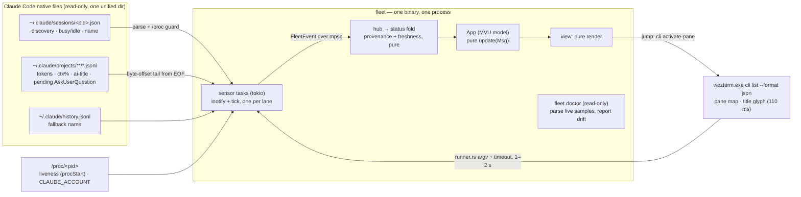
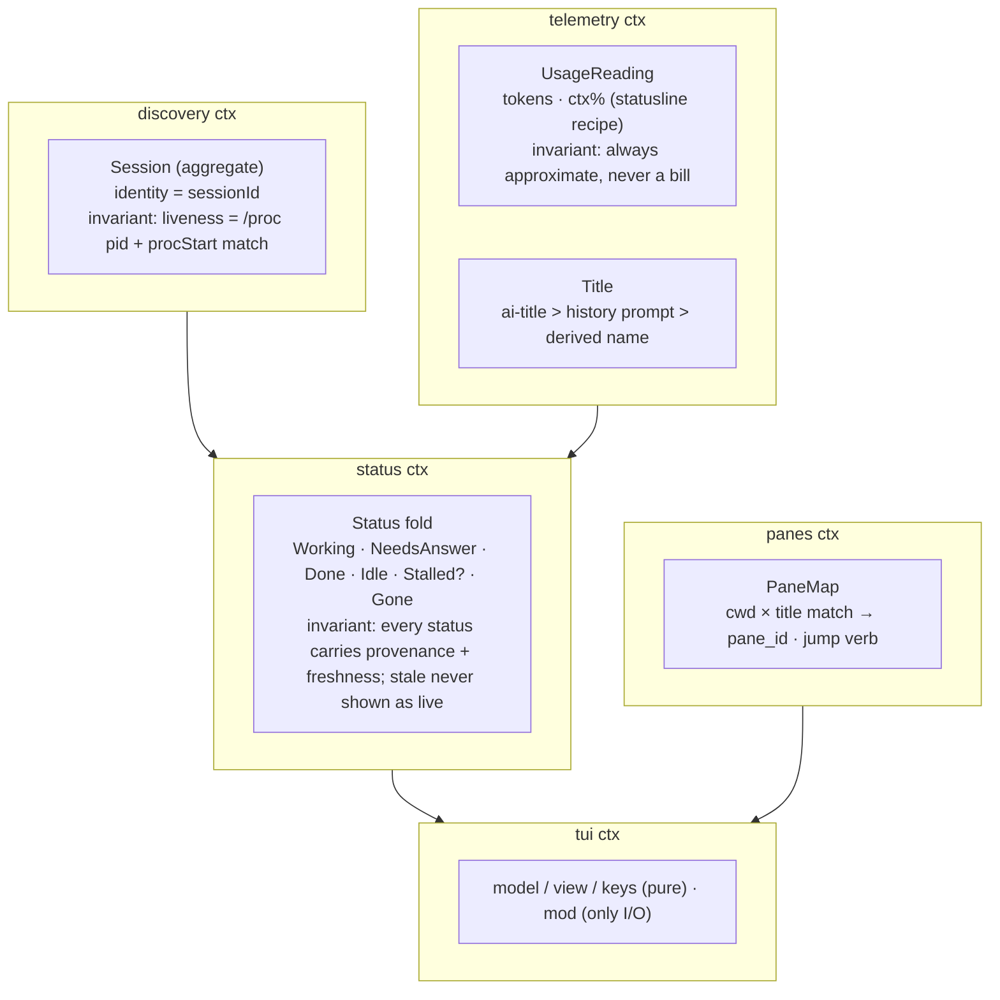
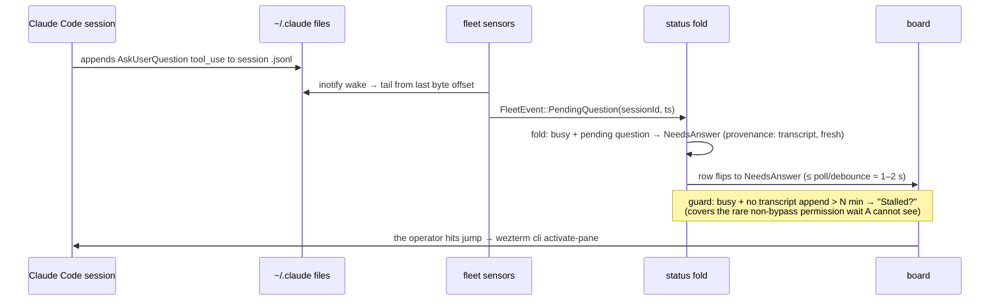
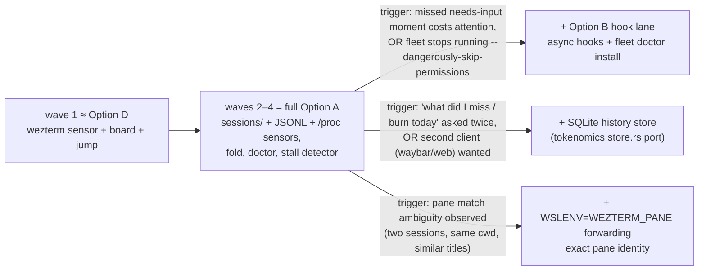

# Fleetops architecture — Synthesis & Decision

> **Recommendation: Option A — sensor fusion, single process (with D as its first vertical slice, B as a trigger-gated evolution).**
> One read-only `fleet` binary fuses four native sources Claude Code already writes — no hooks, no daemon, no SQLite; the push lane and the store are named, additive later waves with measurable triggers.
> Confidence: **high** for v1 — the verdict flips only if the operator's workflow returns to permission-prompt-gated sessions (then the B hook lane fires early).

## Context

Fleetops monitors all running Claude Code sessions on this WSL2 machine (~17 concurrent, 6 accounts):
semantic name, status (working / needs input / done), tokens, context %, wezterm pane + jump. Recon
(01) established the decisive facts: Claude Code **natively maintains** `~/.claude/sessions/<pid>.json`
(discovery + busy/idle + name); all accounts symlink to **one** transcript store; transcripts carry
tokens/context/ai-titles/pending AskUserQuestion but **never permission prompts**; the existing
wezterm status hook is a verified **no-op** (`WEZTERM_PANE` never crosses into WSL); wezterm pane
titles already carry Claude's live title + status glyph; and **all 17 live sessions run
`--dangerously-skip-permissions`**, suppressing the one event class only hooks can see. Prior art
(02): robust tools hybridize pull lanes; hooks are flaky exactly where they'd be load-bearing
(#13024, #12048, #8320, #40506); nobody solves needs-input cleanly without owning the launch.

## Options considered

| Option | One-liner | Weighted score |
|---|---|---|
| **A — sensor fusion, single process** | Read-only fusion of sessions/*.json + JSONL tails + /proc + wezterm CLI; zero install | **4.25** |
| B — A + async hook push | A plus `async:true` hooks via `fleet doctor` into 7 settings.json | 3.55 |
| C — tokenomics twin | Collector daemon + SQLite WAL + TUI reader; history/sparklines | 2.80 |
| D — wezterm lens | Poll pane titles/glyphs only; do-less baseline | 3.35 |

## Decision matrix

Weights = METHOD defaults (no adjustment needed: this is a solo-operator ops tool — simplicity and
agentic fit already carry the right emphasis). Scores cite 01/02/04.

| Criterion | Wt | A | B | C | D |
|---|---|---|---|---|---|
| Simplicity & operability | 20% | **5** — one process, zero install, zero drift surface (04 A-adv) | 3 — doctor + 7 drifting settings.json, Ask-first repairs (01 D4, 04 B-pros) | 2 — daemon + heartbeat + migrations; the six-staleness-bug topology (01 pain) | 5 — one poll, near-zero state (04 D-adv) |
| Agentic-development fit | 20% | **4** — pure parsers + fixtures + bridge hub; −1 for four undocumented formats (01 A1–A5) | 3 — agents can't self-heal Ask-first settings; re-verify at 9 releases/month (04 B-pros) | 3 — best test story but two-binary version-lock chore (01 pain, 04 C-pros) | 3 — thinnest surface but core signal unverifiable against documented truth (04 D-pros) |
| Domain fit (DDD) | 15% | **4** — Session aggregate = sessionId+procStart; NeedsDecision degraded (04 A-pros §1) | 5 — full status vocabulary incl. NeedsDecision (04 B-adv) | 4 — same vocabulary; freshness invariant split across two processes (04 C-pros) | 1 — "pane is the row" breaks identity; no NeedsAnswer (04 D-pros §3) |
| Evolution & headroom | 15% | **5** — hooks/SQLite/WSLENV all additive sensors; exit ≈ 0 (03 A) | 4 — additive to SQLite; hook cost already sunk | 2 — end-state shape, store schema is a contract, exit high (03 C) | 3 — grows into A but replaces identity keystone (04 D-pros) |
| Testability (TDD) | 10% | 4 — all parsers pure with fixtures; fold table-tested (03 A) | 4 — same + hook script vs fixture stdin (03 B) | **5** — tokenomics-proven suite ports verbatim (03 C) | 3 — glyph classifier has no ground truth to test against |
| Delivery speed | 10% | 3 — 3–4 waves (03 A) | 3 — 4–5 waves | 2 — 5–7 waves | **5** — 1 wave |
| Cost | 5% | 4 | 3 | 2 | **5** |
| Risk & reversibility | 5% | 4 — misses rare NeedsDecision; fully reversible | 3 — async hooks can lie silently (04 cross-exam B) | 2 — durable wrong rows, migrations forever (04 C-pros §4) | 2 — single fallback-less assumption A2 |
| **Weighted total** | | **4.25** | **3.55** | **2.80** | **3.35** |

**Sensitivity:** A survives every ±5pp adjacent-weight swap (largest gap to runner-up B is 0.70;
shifting 5pp from Simplicity to Domain-fit moves A 4.25→4.20, B 3.55→3.65 — no flip). The one
non-weight sensitivity: if `--dangerously-skip-permissions` stops being the fleet norm, B's
Domain-fit advantage becomes load-bearing → that is the named trigger for the hook wave, not a
reason to pre-pay it.

## Recommended architecture

### Domain boundaries

### Critical flow — needs-input detection (the highest-stakes path)

## Evolution path

## Risk register (from A's prosecution — 04)

| Risk | Likelihood | Detection signal | Mitigation / accepted |
|---|---|---|---|
| Permission-blocked session renders Working (non-bypass session) | Low (fleet runs bypass mode) | Stall detector: busy + no transcript append > N min → `Stalled?` | Mitigated + named trigger promotes hook lane |
| Four-sensor merge reproduces stale-shown-as-live class | Medium | Freshness stamp rendered on every row; sensor-disagreement counter in footer | Domain invariant: provenance + freshness mandatory on Status; tokenomics fixes ported as tests |
| Silent internals drift (A1/A2/A3, 9 CC releases/month) | Medium–High | `fleet doctor` (read-only): parse live samples, report unknown types/versions at startup + on demand | Tolerant parsers (match needed fields, skip unknown); fixtures per observed version |
| JSONL parse cost on 22 MB transcripts | Low | Per-sensor tick-time metric | Tail from EOF byte offset only; never full-parse; PollWatcher fallback |
| Prior art says hybridize (pull-only insufficient) | Low | Same as row 1 | A *is* a hybrid of four pull lanes; push lane is one wave away by design |

## Pre-mortem (12 months later, it failed because…)

1. **CC release changed `sessions/<pid>.json` and nobody noticed** — board showed ghost sessions for weeks; trust died. → Detection: doctor drift report at startup; ghost rate visible via /proc disagreement. Response: parser fix + fixture for new version (hours, one sensor).
2. **A permission prompt sat invisible for an hour** (a non-bypass session crept in); the operator reverted to scanning panes manually. → Detection: `Stalled?` state fires; if seen twice, hook-lane trigger has fired — build B wave. Response: pre-planned, additive.
3. **The fold grew heuristics until nobody could predict the shown status** (agentic-dev amplification of threshold tweaks). → Detection: fold is a pure table-tested function; PR rule — every fold change needs a table row. Response: rules/ discipline, review gate.
4. **wezterm title format changed; pane match silently degraded to cwd-only** and jump landed on wrong panes for same-cwd sessions. → Detection: match-confidence shown per row; ambiguous matches marked. Response: WSLENV forwarding wave (exact identity), a config-level fix.
5. **Fleet grew 10×; per-tick rescans lagged the UI.** → Detection: tick-time metric in footer. Response: mtime-gated watch set (already 99% reduction, 01 D3), event-driven only.

## Assumptions carried into this decision

- A1 `sessions/<pid>.json` persists across CC versions (fallback: process scan + JSONL mtime — degraded, not dead).
- A2 wezterm glyph/title convention recognizable (fallback: cwd matching; status from other sensors).
- A4 fleet scale ~17 concurrent / ~42 daily (10× headroom verified for inotify).
- A6 native `busy` does not distinguish permission-wait — **assumed true and designed around** (stall detector), verify during wave 2.
- `--dangerously-skip-permissions` remains the fleet norm (sensitivity note above; flip = hook-lane trigger).

## First implementation steps (TDD)

1. **Failing test first:** `domain::tests::fold_priority_table` — Status fold over (sensor event × freshness) table, incl. `busy + stale tail → Stalled?` and `pending AskUserQuestion → NeedsAnswer`. Pure, no I/O.
2. **Walking skeleton (wave 1 ≈ Option D):** fixture `wezterm-list.json` → parser test → CannedRunner → board renders N pane rows in TestBackend snapshot → `jump` builds `activate-pane` argv (pure builder test). Ship: a board that lists panes and jumps.
3. **Wave 2 — discovery:** fixture `sessions/<pid>.json` + fake /proc trait → liveness tests (dead PID, PID reuse via procStart) → live rows replace pane rows as the aggregate.
4. **Wave 3 — telemetry:** JSONL tail codec (port bridge `codec/ndjson` pattern): byte-offset tail, partial-line buffer, tolerant types; fixtures for ai-title, usage/ctx% recipe, pending-question, compaction line. Board gains name/tokens/ctx%.
5. **Wave 4 — fold + doctor + polish:** sensor disagreement counter, freshness rendering, `fleet doctor` self-check, stall detector, account colors (from /proc attribution).

Dossier: [README](./README.md) · [01 deep dive](./01-deep-dive.md) · [02 case studies](./02-case-studies.md) · [03 options](./03-options.md) · [04 steelman](./04-steelman.md)
